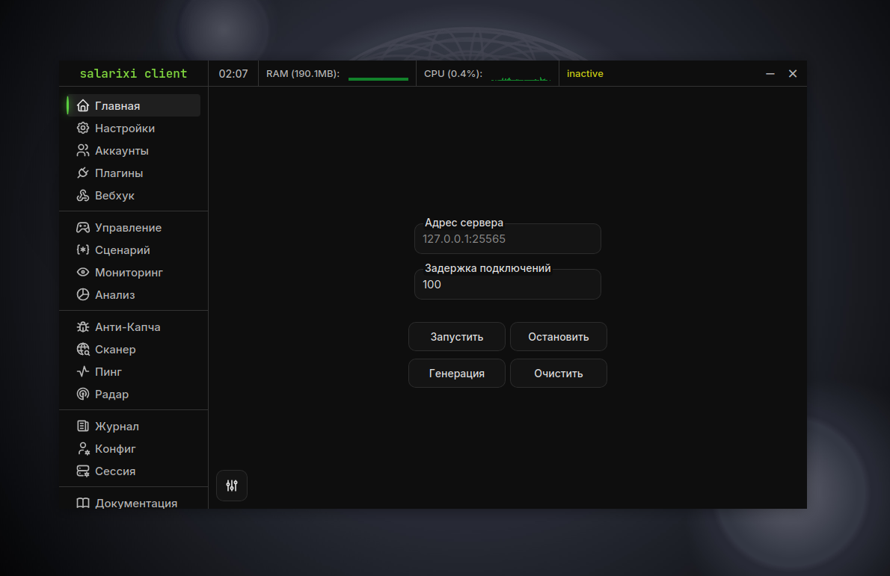
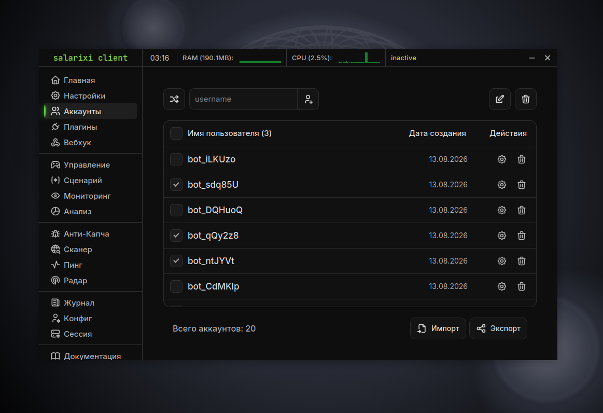

## About

**salarixi** - a feature-rich, multi-task, and lightweight tool for botting in Minecraft. It has a lot of settings that can be quickly adjusted to your goals. This tool also offers a lot of features for managing bots, there are many separate management modules, scripting, and it is also unique for its optimized and fast monitoring capabilities (graphs, bot profiles, chats with bots), they allow you to filter data on the fly, manage specific bots.

---

Uses [azalea](https://github.com/azalea-rs/azalea) library as a base.

---

> [!WARNING]
> This client does not promise stability and good support on all operating systems. If you encounter any problems, please report them to the [issues](https://codeberg.org/nullclyze/salarixi/issues). If the message concerns an error or bug, it should include the client version, operating system, clear description of the problem, screenshots.

---

> [!IMPORTANT]
> This is just a fun project.

## Donate

Liked the project? Support me: [click](https://www.tinkoff.ru/rm/r_RLPlAMDRde.PvdqgZSnCT/bEUIT9180)

## Philosophy

1. **Minimalism:** When developing this client, i don't try to solve every possible problem in this scope, i only address the "critical" part. This doesn't mean i'm covering up my laziness in implementing features, it means i'm trying to get rid of unnecessary, unused cruft.

2. **Lightweight:** The client doesn't carry hundreds of different dependencies, which would entail numerous unused sections of code. Every implementation in the client is, or will be, optimized in some way. This point can be considered a branch of **Minimalism**, as it directly impacts **Lightweight**.

3. **Flexibility:** This isn't just another "customizable client" refrain. It means that any client functionality that can be customized should be configurable by the average user. Unfortunately, there's currently an exception - plugins (even before they were added to the client, they were planned to be unconfigurable). I'm working on it.

4. **Uniqueness:** I try to elevate this project by incorporating my own unique solutions and ideas, which sometimes just pop into my head. Sometimes these solutions are ridiculous, but sometimes they solve real problems. And i try to minimize the use of other people's solutions. This doesn't mean "reinventing the wheel" - i certainly won't write Rust from scratch. What I mean is that I don't borrow solutions from other people's projects that might be poorly designed or unsuitable for my architecture.

5. **Non-AI:** I don't mean to insult LLM's with this point. I'm saying that the aggressive use of AI in any project is a recipe for disaster. If a thousand lines of code were written by an AI, and a human can't explain the logic behind it, ask it to fix something - do you think it will? Of course not. So why didn't the same AI fix it? It's simple: AI writes terrible code one way or another (whether on the frontend or the backend), which is riddled with hidden errors. Unable to fix them, it will struggle to rewrite its own flawed architecture. And it won't succeed, it will simply destroy all the logic with its convoluted and irrelevant decisions.

## Social

- [Telegram](https://t.me/+sXNq1tAwOsFmMGMy) - Our official Telegram channel, where we publish client news and upcoming plans
- [YouTube](https://www.youtube.com/@salarixi) - Our official YouTube channel, where we publish video reviews of the client
- [Discord](https://discord.gg/Gaqsnvrytf) - Our official Discord server, where we communicate and share ideas

## System requirements

- **Operating system:** Windows, Linux
- **Free disk space:** 60MB
- **RAM (for program only):** Minimum 200MB
- **Processor:** Average
- **Dependencies:** None

## Documentation

You can read usage documentation on our [website](https://salarixi.freedev.app/pages/documentation.html).

## Features

- **Easy to use:** Quick adaptation, intuitive interface.
- **No dependencies:** You only need to install one file for a fully functioning client.
- **Fast and efficient:** All transactions in tool are fast, convenient hot keys are provided for efficient control.
- **Language support:** English, Turkish, Japanese, and Chinese are partially supported. Russian is 100% supported.
- **Absolutely free:** All functionality is free.
- **Open-source:** Tool is completely open-source.
- **Lightweight:** This is the lightest tool among all similar alternatives. Installation file is ~14MB, and total size on disk after installation is ~60MB.
- **Beautiful design:** Tool has a clear and beautiful dark design.
- **RAM friendly:** At launch, app requires only ~5MB of RAM for the main process. There's also a webview for rendering the interface, which requires an average of ~118 MB of RAM. Total RAM usage is ~125MB. When running 50 bots, the main application process consumes ~72MB of RAM.
- **Customization:** You can customize any interface color using a style kit.
- **Event logging:** Tool has a log in which any information is logged.
- **Feature-rich:** Tool has many features for working with bots.
- **Visualization:** For convenience, tool visualizes the data in form of charts.
- **Monitoring:** Tool has real-time bot monitoring (health, food, chat...).
- **Cheat functions:** Tool contains unique functionality in form of real cheats for bots.
- **Proxy support:** Tool supports SOCKS5 proxy.
- **Proxy finder:** Tool has a proxy collector that can find up to 50,000 at a time.
- **Script writing:** You can write your own scripts for bots.
- **Utilities:** Anti-captcha, scanner, radar, ping.
- **Plugins:** Tool has many built-in plugins for bots.
- **Multi-task:** Tool allows bots to perform dozens of actions simultaneously and avoid conflicts.

In short: The client is suitable for you if you don't want to bother with installation, need minimal resource consumption, need advanced customization, and need a lot of built-in features.

## Screenshots




## Installation

### Windows MSI

1. Download `...-windows.msi` file from releases page
2. Run downloaded file
3. Go through installation process
4. Ready

### Windows NSIS

1. Download `...-windows.exe` file from releases page
2. Run downloaded file
3. Go through installation process
4. Ready

### Debian-based Linux

1. Download `...-linux.deb` file from releases page
2. Open directory with downloaded file in terminal
3. Write ```sudo dpkg -i FILENAME.rpm```
4. Ready

### RedHat-based Linux

1. Download `...-linux.rpm` file from releases page
2. Open directory with downloaded file in terminal
3. Write ```sudo dnf install FILENAME.rpm```
4. Ready

## Build

### Clone repository

```bash
git clone https://codeberg.org/nullclyze/salarixi.git
```

### Dependencies

1. Rust & Cargo (nightly)
2. NodeJS & NPM

**Check dependencies:**

```bash
rustc --version && cargo --version && node --version && npm --version
```

**Output example:**

```bash
rustc 1.94.0-nightly
cargo 1.94.0-nightly
v22.19.0
11.11.1
```

### Build steps

In the root directory of the project, write in the terminal (installing NodeJS modules):

```bash
npm i
```

Then create binary files (will create files along the path `./target/release/bundle`):

```bash
npm run tauri build
```

To run the application in dev mode:

```bash
npm run tauri dev
```

## Additional information

- **License:** [Apache-2.0 license](./LICENSE)
- **Latest release:** [Open](https://codeberg.org/nullclyze/salarixi/releases/latest)
